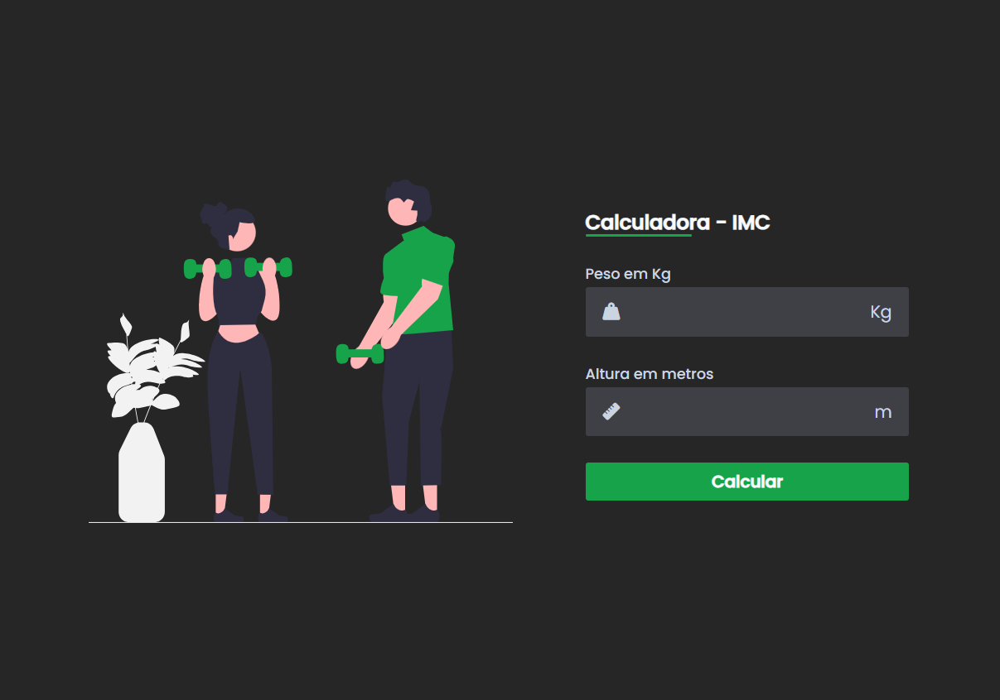

<h1 align="center"> calculadora de IMC 🧮 </h1>

Projeto exclusivo de minha autoria e 
Larissa Kich.

 

  

## 🚀 Tecnologias

Esse projeto foi desenvolvido com as seguintes tecnologias:

- HTML e CSS
- JavaScript
- Git e Github

## 💻 Projeto

O Projeto se trata de uma calculadora de IMC que calcula e lhe dar um informações sobre seu Peso.